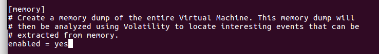

# Instalasi

1. Kelompok kami menggunakan OS ubuntu-16.04.3 untuk mengistall Cuckoo. Langkah pertama adalah download file cucko di halaman ``` https://downloads.cuckoosandbox.org/``` Pilih yg cuckoo-current.tar.gz


<br>

2. Setelah selesai mendownload cuckoo-current, maka ekstrak hasil downloadan Anda dengan mengetikkan ```tar-xvzf cuckoo-current.tar.gz```

3. Install python dan library python lainnya dengan 
``` sudo apt-get install python python-pip python-dev libffi-dev libssl-dev ```
```sudo apt-get install python-virtualenv python-setuptools```
```sudo apt-get install libjpeg-dev zlib1g-dev swig```


4. Untuk menggunakan Django-based Web Interface, install MongoDB ```sudo apt-get install mongodb```

<br>

5. Install tcpdump untuk membuang aktivitas jaringan yang dilakukan oleh malware selama eksekusi diperlukan sniffer jaringan yang dikonfigurasi dengan benar untuk menangkap lalu lintas 
```sudo apt-get install tcpdump apparmor-utils```
```sudo aa-disable /usr/sbin/tcpdump```


<br>

6. Clone volatility dari github lalu install


<br>

7. Setelah itu download distorm, lalu install


<br>

8. Setelah itu download Yara, lalu install.

<br>

9. Masuk folder cuckoo yang telah diekstrak tadi. Lalu masuk folder conf. Ubah file - file yang ada di dalamnya menggunakan 
```nano cuckoo.conf```
```nano auxiliary.conf```
```nano virtualbox.conf```
```nano processing.conf```
```nano memory.conf```
```nano reporting.conf```





<br>

10. Masuk folder web 

```cd .. ```

```cd web```
<br>

11. Jalankan perintah berikut ```./manage.py runserver```

<br>

12. Buka halaman ```127.0.0.1:8000``` pada browser.

<br>

13. Buka Windows XP dari virtualbox.
<br>

14. Matikan firewall dari WindowsXP agar tak ada yang menghalangi pertukaran data antara host dan WindowsXP

<br>

15. Setelah itu, share folder agent di dalam folder cuckoo dengan klik kanan folder agent, lalu pilih Local Network Share

<br>

16. Buka virtual box, klik kanan Windows XP, pilih preference, pilih shared folders, pilih folder agent.

<br>

17. Salin file agent.py dari folder share diatas ke folder startup Widows XP

<br>

18. Coba restart Windows XP untuk melihat berjalan atau tidak

<br>

19. Sebelum menjalankan program cuckoo di host, masukkan perintah berikut di dalam folder cuckoo untuk mendapatkan utility lain yang diperlukan dalam cuckoo
```sudo ./utils/community.py -waf```

<br>

20. Jalankan cuckoo dengan perintah ```./cuckoo.py ```

<br>
